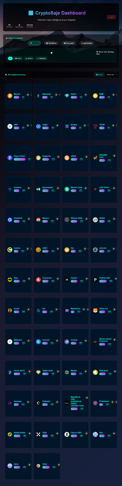

# CryptoSaje

CryptoSaje is an AI-powered crypto intelligence dashboard designed to help users explore market opportunities through a branded dashboard experience, account access, category filters, and future automation for alerts and strategy views.

## Overview

CryptoSaje is built as a crypto-focused intelligence hub combining product design, market dashboard thinking, and a roadmap toward automated alerts and smarter signal tracking.

## Problem

Many crypto tools are either too cluttered, too basic, or too fragmented. CryptoSaje is designed to create a cleaner, more accessible interface for exploring crypto categories, trends, and future automation-driven insights.

## Who It’s For

- Retail crypto users looking for a cleaner dashboard experience
- Users interested in AI coins, underdogs, alerts, and trend tracking
- Future users evaluating a more guided crypto intelligence platform

## Current Status

In-progress MVP

## Core Features

- Branded login flow
- Create account flow
- Password recovery flow
- Crypto dashboard interface
- Coin card display and filter system
- Category views such as AI, top gainers, top losers, and high volume
- Strategy-view product direction
- Future roadmap for alerts and automation

## Live Demo

- Replit App: https://49e903ad-f527-477e-98f2-df43b784ce3c-00-28i9tkbot3g4n.riker.replit.dev:3001/
- Domain: https://cryptosaje.it.com

## Screenshots / Demo

### Dashboard Overview

### Top Losers View

### High Volume View

### Logged-in Dashboard State

## Tech Stack

- Frontend: HTML, CSS, JavaScript
- Backend: JavaScript app logic
- Database: Firebase / local app state depending on feature area
- Auth: Prototype login flow / authentication layer in progress
- Hosting: Replit
- APIs/Data Sources: CoinGecko API, fallback/local demo data, strategy.json

## What’s Working Now

- Branded login flow
- Dashboard access
- Coin display cards
- Category/filter views
- Working product shell and visual dashboard experience
- Partial live/fallback data functionality
- Authenticated product flow

## What’s Not Fully Finished Yet

- Strategy view toggle wiring
- HOLD / WATCH / TRIM-SELL strategy filters
- Fully reliable autonomous Discord alerts
- Fully accurate live update logic across all dashboard states
- Stronger top-level metrics and insight summaries

## My Role

I led the product vision, brand direction, dashboard design, workflow structure, and implementation of the login flow, crypto interface, and evolving strategy and alert system direction.

## Setup Instructions

1. Clone the repository
2. Open the project in Replit or your local editor
3. Add required environment variables and API configuration
4. Run the app
5. Test login flow, dashboard access, and category filters

## Notes

CryptoSaje is currently an in-progress MVP with strong product design and dashboard presentation. The UI and product shell are ahead of the full backend logic, and alert/intelligence automation is still being improved.

## Update Log

- 2026-03-26 — Repository created and README structured for portfolio presentation
